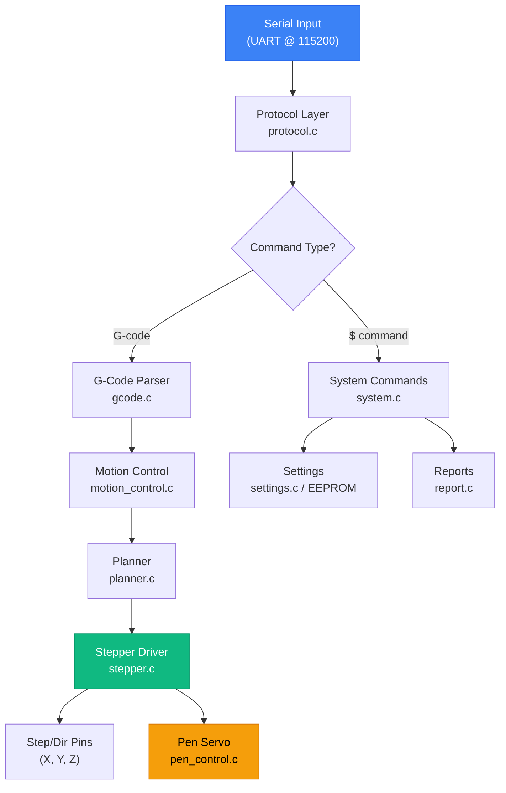
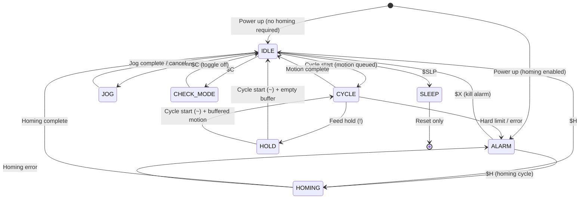

# GRBL v1.1f — Pen Plotter Firmware Documentation

## 1. Project Overview

| Property | Value |
|---|---|
| **Base Firmware** | GRBL v1.1f (build `20170801`) |
| **Target MCU** | ATmega328P (Arduino Uno/Nano) |
| **License** | GPLv3 |
| **CPU Map** | `CPU_MAP_ATMEGA328P_SERVO` |
| **Default Profile** | `DEFAULTS_GENERIC` |
| **Serial Baud** | 115200 |
| **Key Customization** | **Pen servo** via Z-axis position mapping |

This is a **highly optimized, stripped-down edition of GRBL** tailored specifically for a **2-axis pen plotter** with a servo-driven pen lift mechanism. To maximize flash space and performance on the ATmega328P, all features irrelevant to a pen plotter (coolant control, probing cycles, variable spindle speed overrides, safety doors, CoreXY kinematics, and tool length offsets) have been completely removed.

The standard GRBL spindle PWM output has been repurposed to drive a hobby servo, and the Z-axis logical position is used to control the pen up/down state — no physical Z stepper is required.

> [!IMPORTANT]
> The `VARIABLE_SPINDLE` and `COREXY` compile options have been **completely removed**. The spindle output pin is used as a simple enable/disable, while **Timer2 PWM on Digital Pin 11** drives the pen servo.

---

## 2. Architecture Overview



### Data Flow Pipeline

```
G-code String → Parser → Motion Control → Planner Buffer → Segment Buffer → Stepper ISR → Pins
                                                                              ↓
                                                                      Pen Servo (Z-pos check)
```

1. **Serial** receives characters via UART RX interrupt into a ring buffer.
2. **Protocol** reads complete lines and dispatches to the G-code parser or system command handler.
3. **G-Code Parser** validates and translates G-code blocks into motion commands.
4. **Motion Control** converts parsed commands into planner line/arc segments.
5. **Planner** computes velocity profiles with look-ahead acceleration management.
6. **Stepper** ISR (Timer1) executes Bresenham line algorithm, generating step pulses. On each new segment load, it calls `set_pen_pos()` to update the servo.
7. **Pen Servo** reads the Z work position: Z ≥ 0.1mm → pen up; Z < 0.1mm → pen down.

---

## 3. Module Reference

### 3.1 Core Modules

| Module | Files | Purpose |
|---|---|---|
| **Main** | [main.c](file:///c:/Users/sir/Desktop/firmware/Penplotter/grbl/main.c) | Entry point, initialization sequence, main reset loop |
| **Protocol** | [protocol.c](file:///c:/Users/sir/Desktop/firmware/Penplotter/grbl/protocol.c), [protocol.h](file:///c:/Users/sir/Desktop/firmware/Penplotter/grbl/protocol.h) | Main execution loop, serial line parsing, realtime command execution |
| **G-Code Parser** | [gcode.c](file:///c:/Users/sir/Desktop/firmware/Penplotter/grbl/gcode.c), [gcode.h](file:///c:/Users/sir/Desktop/firmware/Penplotter/grbl/gcode.h) | Simplified RS274/NGC G-code interpreter with modal group tracking |
| **System** | [system.c](file:///c:/Users/sir/Desktop/firmware/Penplotter/grbl/system.c), [system.h](file:///c:/Users/sir/Desktop/firmware/Penplotter/grbl/system.h) | System-level commands (`$` commands), state machine, realtime executor flags |

---

### 3.2 Motion Pipeline

| Module | Files | Purpose |
|---|---|---|
| **Motion Control** | [motion_control.c](file:///c:/Users/sir/Desktop/firmware/Penplotter/grbl/motion_control.c), [motion_control.h](file:///c:/Users/sir/Desktop/firmware/Penplotter/grbl/motion_control.h) | High-level motion API: line, arc, dwell, homing |
| **Planner** | [planner.c](file:///c:/Users/sir/Desktop/firmware/Penplotter/grbl/planner.c), [planner.h](file:///c:/Users/sir/Desktop/firmware/Penplotter/grbl/planner.h) | Acceleration-managed motion planning with look-ahead |
| **Stepper** | [stepper.c](file:///c:/Users/sir/Desktop/firmware/Penplotter/grbl/stepper.c), [stepper.h](file:///c:/Users/sir/Desktop/firmware/Penplotter/grbl/stepper.h) | Timer1 ISR step generation, AMASS smoothing, segment buffer |

---

### 3.3 Peripherals & I/O

| Module | Files | Purpose |
|---|---|---|
| **Pen Control** | [pen_control.c](file:///c:/Users/sir/Desktop/firmware/Penplotter/grbl/pen_control.c), [pen_control.h](file:///c:/Users/sir/Desktop/firmware/Penplotter/grbl/pen_control.h) | Pen servo control (up/down), pen enable pin |
| **Limits** | [limits.c](file:///c:/Users/sir/Desktop/firmware/Penplotter/grbl/limits.c), [limits.h](file:///c:/Users/sir/Desktop/firmware/Penplotter/grbl/limits.h) | Homing cycle, hard/soft limit management |
| **Serial** | [serial.c](file:///c:/Users/sir/Desktop/firmware/Penplotter/grbl/serial.c), [serial.h](file:///c:/Users/sir/Desktop/firmware/Penplotter/grbl/serial.h) | UART TX/RX with ring buffers and realtime command interception |
| **Jog** | [jog.c](file:///c:/Users/sir/Desktop/firmware/Penplotter/grbl/jog.c), [jog.h](file:///c:/Users/sir/Desktop/firmware/Penplotter/grbl/jog.h) | `$J=` jogging command support |

---

### 3.4 Configuration & Utilities

| Module | Files | Purpose |
|---|---|---|
| **Config** | [config.h](file:///c:/Users/sir/Desktop/firmware/Penplotter/grbl/config.h) | Compile-time options: homing cycles, overrides, buffers, features |
| **CPU Map** | [cpu_map.h](file:///c:/Users/sir/Desktop/firmware/Penplotter/grbl/cpu_map.h) | ATmega328P pin assignments (servo variant) |
| **Defaults** | [defaults.h](file:///c:/Users/sir/Desktop/firmware/Penplotter/grbl/defaults.h) | Machine-specific default settings (Generic + MidTBot profiles) |
| **Settings** | [settings.c](file:///c:/Users/sir/Desktop/firmware/Penplotter/grbl/settings.c), [settings.h](file:///c:/Users/sir/Desktop/firmware/Penplotter/grbl/settings.h) | EEPROM settings read/write, `$x=value` handling |
| **EEPROM** | [eeprom.c](file:///c:/Users/sir/Desktop/firmware/Penplotter/grbl/eeprom.c), [eeprom.h](file:///c:/Users/sir/Desktop/firmware/Penplotter/grbl/eeprom.h) | Low-level EEPROM read/write |
| **Report** | [report.c](file:///c:/Users/sir/Desktop/firmware/Penplotter/grbl/report.c), [report.h](file:///c:/Users/sir/Desktop/firmware/Penplotter/grbl/report.h) | Status messages, error codes, realtime status report |
| **Print** | [print.c](file:///c:/Users/sir/Desktop/firmware/Penplotter/grbl/print.c), [print.h](file:///c:/Users/sir/Desktop/firmware/Penplotter/grbl/print.h) | Integer/float serial print helpers |
| **Nuts & Bolts** | [nuts_bolts.c](file:///c:/Users/sir/Desktop/firmware/Penplotter/grbl/nuts_bolts.c), [nuts_bolts.h](file:///c:/Users/sir/Desktop/firmware/Penplotter/grbl/nuts_bolts.h) | Shared macros, axis defines, delay functions, float parsing |
| **Master Header** | [grbl.h](file:///c:/Users/sir/Desktop/firmware/Penplotter/grbl/grbl.h) | Version string, library includes, compile-time error checks |

---

## 4. Pin Mapping (CPU_MAP_ATMEGA328P_SERVO)

### 4.1 Digital Pins

| Arduino Pin | ATmega Port | Function | Direction |
|:-----------:|:-----------:|----------|:---------:|
| **D2** | PD2 | X Step | Output |
| **D3** | PD3 | Y Step | Output |
| **D4** | PD4 | Z Step (Unused by servo plotter) | Output |
| **D5** | PD5 | X Direction | Output |
| **D6** | PD6 | Y Direction | Output |
| **D7** | PD7 | Z Direction (Unused by servo plotter) | Output |
| **D8** | PB0 | Stepper Enable (active low) | Output |
| **D9** | PB1 | X Limit Switch | Input (pull-up) |
| **D10** | PB2 | Y Limit Switch | Input (pull-up) |
| **D11** | PB3 | **Pen Servo PWM** (Timer2 OC2A) | Output |
| **D12** | PB4 | Z Limit Switch (Unused by servo plotter) | Input (pull-up) |
| **D13** | PB5 | Spindle Enable / LED | Output |

### 4.2 Analog Pins

| Arduino Pin | ATmega Port | Function | Direction |
|:-----------:|:-----------:|----------|:---------:|
| **A0** | PC0 | Reset Control | Input (pull-up) |
| **A1** | PC1 | Feed Hold | Input (pull-up) |
| **A2** | PC2 | Cycle Start | Input (pull-up) |
| **A3** | PC3 | Unconfigured / Free | Input |
| **A4** | PC4 | Unconfigured / Free | Input |
| **A5** | PC5 | Unconfigured / Free | Input |

### 4.3 Timer Allocation

| Timer | Usage | Configuration |
|:-----:|-------|---------------|
| **Timer0** | Step pulse reset (OVF interrupt) | Normal mode, 1/8 prescaler |
| **Timer1** | Stepper driver ISR (COMPA interrupt) | CTC mode, variable prescaler |
| **Timer2** | **Pen Servo PWM** (OC2A on D11) | Fast PWM 8-bit, 1/1024 prescaler → **~61 Hz** |

---

## 5. Pen Servo System

The pen mechanism is controlled by a **standard hobby servo** connected to **Digital Pin 11** (Timer2 OC2A output). The Z-axis work coordinate position determines pen state:

```
Z work position ≥ 0.1 mm  →  Pen UP   (servo to tick 16)
Z work position < 0.1 mm  →  Pen DOWN (servo to tick 31)
```

### 5.1 PWM Timing Math

```
MCU Clock:     16,000,000 Hz
Prescaler:     1024
Timer Freq:    16,000,000 / 1024 = 15,625 Hz
8-bit overflow: 15,625 / 256 = ~61 Hz  (close to 50 Hz servo standard)

1 tick = 1/15625 = 0.000064 sec = 64 µs

Servo 0° position:   0.001 s / 0.000064 s = ~16 ticks
Servo 180° position: 0.002 s / 0.000064 s = ~31 ticks
```

### 5.2 Key Functions

Defined in [pen_control.c](file:///c:/Users/sir/Desktop/firmware/Penplotter/grbl/pen_control.c):

| Function | Location | Description |
|----------|:--------:|-------------|
| [init_servo()](file:///c:/Users/sir/Desktop/firmware/Penplotter/grbl/pen_control.c#L57-L63) | Line 57 | Configures Timer2 for servo PWM, calls `set_pen_pos()` |
| [pen_up()](file:///c:/Users/sir/Desktop/firmware/Penplotter/grbl/pen_control.c#L65-L68) | Line 65 | Sets OCR2A = `PEN_SERVO_UP` (16) |
| [pen_down()](file:///c:/Users/sir/Desktop/firmware/Penplotter/grbl/pen_control.c#L70-L73) | Line 70 | Sets OCR2A = `PEN_SERVO_DOWN` (31) |
| [set_pen_pos()](file:///c:/Users/sir/Desktop/firmware/Penplotter/grbl/pen_control.c#L83-L102) | Line 83 | Reads Z work position, calls pen_up/pen_down |

### 5.3 Integration Points

The servo is initialized inside `pen_init()` and called from:

1. **[pen_init()](file:///c:/Users/sir/Desktop/firmware/Penplotter/grbl/pen_control.c#L105)** — Called at boot via `main.c`
2. **[Stepper ISR](file:///c:/Users/sir/Desktop/firmware/Penplotter/grbl/stepper.c#L366-L370)** — `set_pen_pos()` called on each new segment load.

### 5.4 Tuning the Servo

To adjust servo travel, edit these constants in [pen_control.c](file:///c:/Users/sir/Desktop/firmware/Penplotter/grbl/pen_control.c#L40-L41):

```c
#define PEN_SERVO_DOWN     31   // Servo position for pen down
#define PEN_SERVO_UP       16   // Servo position for pen up
```

> [!TIP]
> If the servo moves the wrong way, **swap the values** of `PEN_SERVO_DOWN` and `PEN_SERVO_UP`. For less than full travel, adjust the values within the 16–31 range.

---

## 6. G-Code Support

### 6.1 Supported G-Codes

| Code | Modal Group | Description |
|------|:-----------:|-------------|
| **G0** | G1 (Motion) | Rapid positioning |
| **G1** | G1 | Linear interpolation (feed rate) |
| **G2** | G1 | Clockwise arc |
| **G3** | G1 | Counter-clockwise arc |
| **G4** | G0 (Non-modal) | Dwell |
| **G10 L2/L20** | G0 | Set coordinate system |
| **G17** | G2 (Plane) | XY plane selection |
| **G18** | G2 | ZX plane selection |
| **G19** | G2 | YZ plane selection |
| **G20** | G6 (Units) | Inches mode |
| **G21** | G6 | Millimeters mode |
| **G28** | G0 | Go to predefined position 1 |
| **G28.1** | G0 | Set predefined position 1 |
| **G30** | G0 | Go to predefined position 2 |
| **G30.1** | G0 | Set predefined position 2 |
| **G40** | G7 | Cutter comp off (only mode supported) |
| **G53** | G0 | Move in machine coordinates |
| **G54–G59** | G12 | Work coordinate system select |
| **G61** | G13 | Exact path mode (only mode supported) |
| **G80** | G1 | Cancel canned cycle |
| **G90** | G3 (Distance) | Absolute distance mode |
| **G91** | G3 | Incremental distance mode |
| **G91.1** | G4 | Incremental IJK arc mode |
| **G92** | G0 | Coordinate offset |
| **G92.1** | G0 | Reset coordinate offset |
| **G93** | G5 (Feed) | Inverse time feed rate mode |
| **G94** | G5 | Units per minute feed rate mode |

### 6.2 Supported M-Codes

| Code | Description |
|------|-------------|
| **M0** | Program pause |
| **M1** | Optional stop (parsed but ignored) |
| **M2** | Program end |
| **M3** | Spindle CW (enables spindle pin / servo active) |
| **M5** | Spindle stop / servo disabled |
| **M30** | Program end and rewind |

### 6.3 Pen Plotter G-Code Usage

For the pen plotter, the Z axis controls pen state:

```gcode
G90          ; Absolute positioning
G21          ; Millimeters
G0 Z5       ; Pen UP (Z > 0)
G0 X10 Y10  ; Rapid move to position
G0 Z-1      ; Pen DOWN (Z < 0)
G1 X50 Y50 F3000  ; Draw line at 3000 mm/min
G0 Z5       ; Pen UP
G0 X0 Y0    ; Return home
M2           ; Program end
```

---

## 7. System Commands Reference (`$` Commands)

| Command | Description |
|---------|-------------|
| `$$` | View all settings |
| `$#` | View G-code parameters (coordinate offsets) |
| `$G` | View parser state |
| `$I` | View build info |
| `$I=string` | Set build info string |
| `$N` | View startup blocks |
| `$Nx=line` | Set startup block |
| `$C` | Toggle check mode |
| `$X` | Kill alarm lock |
| `$H` | Run homing cycle |
| `$J=...` | Jog command |
| `$RST=$` | Restore settings to defaults |
| `$RST=#` | Clear coordinate parameters |
| `$RST=*` | Full EEPROM wipe and restore |

### Realtime Commands (no newline needed)

| Character | Hex | Function |
|:---------:|:---:|----------|
| `?` | 0x3F | Status report |
| `~` | 0x7E | Cycle start / Resume |
| `!` | 0x21 | Feed hold |
| Ctrl+X | 0x18 | Soft reset |
| — | 0x85 | Jog cancel |
| — | 0x90–0x94 | Feed overrides |

---

## 8. Settings Reference (`$x=value`)

| Setting | Parameter | Default (Generic) | Units |
|:-------:|-----------|:------------------:|:-----:|
| `$0` | Step pulse time | 10 | µs |
| `$1` | Stepper idle lock time | 25 | ms |
| `$2` | Step port invert mask | 0 | bitmask |
| `$3` | Direction port invert mask | 0 | bitmask |
| `$4` | Invert step enable | 0 | boolean |
| `$5` | Invert limit pins | 0 | boolean |
| `$6` | Deprecated (Unused) | 0 | - |
| `$10` | Status report mask | 1 (MPos) | bitmask |
| `$11` | Junction deviation | 0.01 | mm |
| `$12` | Arc tolerance | 0.002 | mm |
| `$13` | Report in inches | 0 | boolean |
| `$20` | Soft limits enable | 0 | boolean |
| `$21` | Hard limits enable | 0 | boolean |
| `$22` | Homing enable | 0 | boolean |
| `$23` | Homing direction mask | 0 | bitmask |
| `$24` | Homing feed rate | 25.0 | mm/min |
| `$25` | Homing seek rate | 500.0 | mm/min |
| `$26` | Homing debounce delay | 250 | ms |
| `$27` | Homing pull-off | 1.0 | mm |
| `$30` | Deprecated (Unused) | 0.0 | - |
| `$31` | Deprecated (Unused) | 0.0 | - |
| `$32` | Deprecated (Unused) | 0 | - |
| `$100` | X steps/mm | 250.0 | steps/mm |
| `$101` | Y steps/mm | 250.0 | steps/mm |
| `$102` | Z steps/mm | 250.0 | steps/mm |
| `$110` | X max rate | 500.0 | mm/min |
| `$111` | Y max rate | 500.0 | mm/min |
| `$112` | Z max rate | 500.0 | mm/min |
| `$120` | X acceleration | 10.0 | mm/sec² |
| `$121` | Y acceleration | 10.0 | mm/sec² |
| `$122` | Z acceleration | 10.0 | mm/sec² |
| `$130` | X max travel | 200.0 | mm |
| `$131` | Y max travel | 200.0 | mm |
| `$132` | Z max travel | 200.0 | mm |

---

## 9. System State Machine



---

## 10. Initialization Sequence

The boot process in [main.c](file:///c:/Users/sir/Desktop/firmware/Penplotter/grbl/main.c#L36-L91):

```
1. serial_init()     → Configure UART at 115200 baud
2. settings_init()   → Load settings from EEPROM (or restore defaults)
3. stepper_init()    → Configure Timer0, Timer1, step/dir pins
4. system_init()     → Configure control pins + pin-change interrupts
5. Clear sys_position
6. sei()             → Enable global interrupts
7. Set initial state → IDLE or ALARM (if homing required)

Main Loop (forever):
  8.  Reset system variables, preserve state
  9.  serial_reset_read_buffer()
  10. gc_init()          → Reset parser to defaults
  11. pen_init()         → Init pen pin + servo (PEN_SERVO)
  12. limits_init()
  13. plan_reset()        → Clear planner buffer
  14. st_reset()          → Clear stepper subsystem
  15. plan_sync_position()
  16. gc_sync_position()
  17. report_init_message() → Print "Grbl 1.1f"
  18. protocol_main_loop() → Enter command processing loop
```

---

## 11. Homing Configuration

The firmware is configured for **2-axis sequential homing**:

```c
#define HOMING_CYCLE_0 (1<<X_AXIS)  // First: home X
#define HOMING_CYCLE_1 (1<<Y_AXIS)  // Then: home Y
```

| Parameter | Setting | Value |
|-----------|---------|:-----:|
| Init lock | `HOMING_INIT_LOCK` | Enabled |
| Locate cycles | `N_HOMING_LOCATE_CYCLE` | 1 |
| Limits check at init | `CHECK_LIMITS_AT_INIT` | Enabled |

---

## 12. Build & Flash Instructions

### Prerequisites
- Arduino IDE (1.8.x+) or PlatformIO
- Arduino Uno / Nano with ATmega328P
- USB cable

### Arduino IDE Method

1. Copy the entire `grbl` folder into your Arduino libraries directory:
   ```
   <Arduino>/libraries/grbl/
   ```

2. Open the [grblUpload.ino](file:///c:/Users/sir/Desktop/firmware/Penplotter/grbl/examples/grblUpload/grblUpload.ino) example sketch:
   ```
   File → Examples → grbl → grblUpload
   ```

3. Select your board: `Tools → Board → Arduino Uno`

4. Select port: `Tools → Port → COMx`

5. Click **Upload**

---

## 13. File Structure Summary

```
grbl/
├── grbl.h                  # Master include, version, compile checks
├── main.c                  # Entry point & init sequence
├── config.h                # Compile-time feature configuration
├── cpu_map.h               # Pin assignments (SERVO variant)
├── defaults.h              # Default machine profiles
│
├── protocol.c/h            # Main loop, line processing
├── gcode.c/h               # G-code parser (RS274/NGC)
├── system.c/h              # $ commands, state machine
│
├── motion_control.c/h      # High-level motion API
├── planner.c/h             # Acceleration planner (look-ahead)
├── stepper.c/h             # Stepper ISR (Bresenham + AMASS)
│
├── pen_control.c/h         # ★ Pen servo + pen enable
├── limits.c/h              # Homing & hard limits
├── jog.c/h                 # Jog command handler
│
├── serial.c/h              # UART driver
├── settings.c/h            # EEPROM settings management
├── eeprom.c/h              # Low-level EEPROM I/O
├── report.c/h              # Status & error reporting
├── print.c/h               # Serial print helpers
└── nuts_bolts.c/h          # Macros, constants, utilities
```

---

## 14. Key Compile-Time Options (config.h)

| Option | Default | Description |
|--------|:-------:|-------------|
| `CPU_MAP_ATMEGA328P_SERVO` | ✅ Enabled | Servo-variant pin map (defines `PEN_SERVO`) |
| `DEFAULTS_GENERIC` | ✅ Enabled | Generic machine defaults |
| `BAUD_RATE` | 115200 | Serial communication speed |
| `HOMING_INIT_LOCK` | ✅ Enabled | Forces homing before operation |
| `ADAPTIVE_MULTI_AXIS_STEP_SMOOTHING` | ✅ Enabled | AMASS for smooth multi-axis steps |
| `REPORT_FIELD_PIN_STATE` | ✅ Enabled | Include pin states in status report |
| `ACCELERATION_TICKS_PER_SECOND` | 100 | Temporal resolution of acceleration |

---

## 15. Error & Alarm Codes

### Status Codes (returned after each command)

| Code | Meaning |
|:----:|---------|
| 0 | OK |
| 1 | Expected command letter |
| 2 | Bad number format |
| 3 | Invalid `$` statement |
| 4 | Negative value |
| 5 | Setting disabled |
| 8 | Idle error — command requires non-idle state |
| 9 | G-code locked — system in alarm |
| 10 | Soft limit error |
| 14 | Line length exceeded |
| 15 | Travel exceeded |
| 20–38 | Various G-code errors |

### Alarm Codes

| Code | Meaning |
|:----:|---------|
| 1 | Hard limit triggered |
| 2 | Soft limit exceeded |
| 3 | Abort during cycle |
| 6 | Homing fail — reset during cycle |
| 8 | Homing fail — pull-off error |
| 9 | Homing fail — approach error |

---

## 16. Customization Guide

### Switching to MidTBot Defaults

In [config.h](file:///c:/Users/sir/Desktop/firmware/Penplotter/grbl/config.h#L31-L32), change:
```diff
-#define DEFAULTS_GENERIC
+#define DEFAULTS_MIDTBOT
```

### Adjusting Pen Servo Positions

In [pen_control.c](file:///c:/Users/sir/Desktop/firmware/Penplotter/grbl/pen_control.c#L40-L41):
```c
#define PEN_SERVO_DOWN  31   // Decrease for less travel
#define PEN_SERVO_UP    16   // Increase for less travel
```

### Adjusting Pen Threshold

In [pen_control.c](file:///c:/Users/sir/Desktop/firmware/Penplotter/grbl/pen_control.c#L88):
```c
if (wpos_z >= 0.0) {  // Change 0.0 to adjust the Z threshold
```

### Changing Steps/mm via Serial

After flashing, connect at 115200 baud and send:
```
$100=200    ; X steps/mm
$101=100    ; Y steps/mm
$110=15000  ; X max rate mm/min
$111=15000  ; Y max rate mm/min
```
